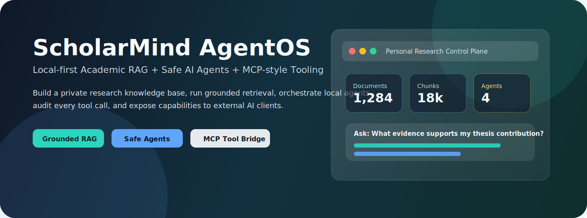
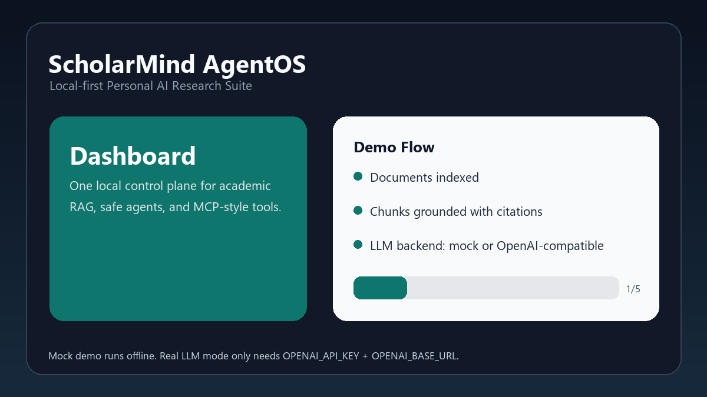
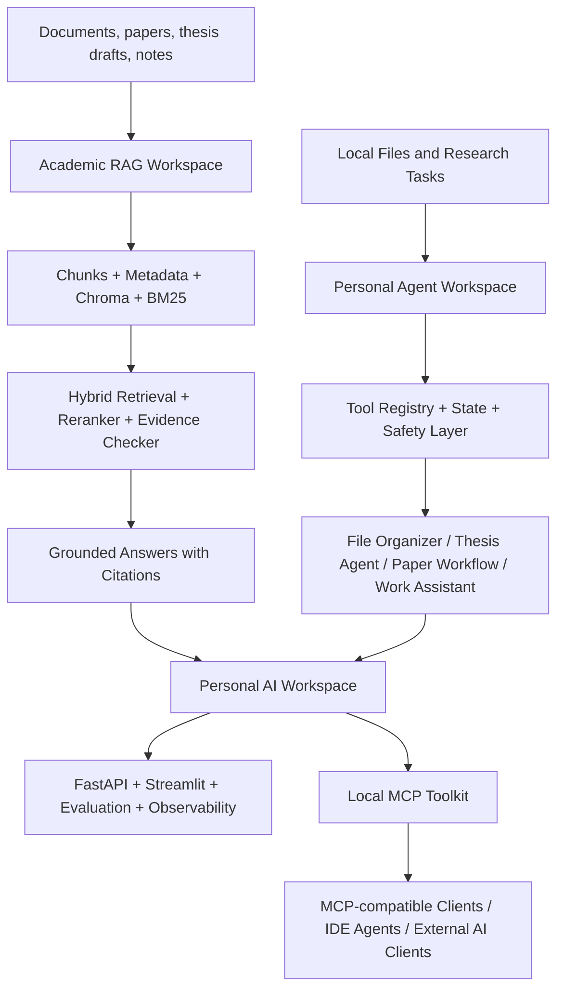

# ScholarMind AgentOS

<p align="center">
  
</p>

<p align="center">
  <a href="https://github.com/Jatshi/personal-ai-research-suite/actions"></a>
  <a href="https://github.com/Jatshi/personal-ai-research-suite"></a>
  <a href="https://streamlit.io"></a>
  <a href="https://www.trychroma.com/"></a>
  <a href="https://modelcontextprotocol.io/"></a>
  
</p>

<p align="center">
  <b>A local-first AI research workspace that combines Academic RAG, safe AI Agents, a Personal AI OS, and an MCP-style tool bridge.</b>
</p>

<p align="center">
  <a href="#-demo">Demo</a> ·
  <a href="#-what-this-repository-contains">Modules</a> ·
  <a href="#-quick-start">Quick Start</a> ·
  <a href="#-architecture">Architecture</a> ·
  <a href="#-documentation">Documentation</a> ·
  <a href="#-resume-description">Resume</a>
</p>

---

## Why This Project

ScholarMind AgentOS is a GitHub-ready monorepo for building a private AI research operating system. It is designed for doctoral thesis work, literature reading, personal knowledge management, local file organization, research planning, and tool-augmented AI workflows.

The project runs in offline mock mode by default, but it also includes OpenAI-compatible LLM and embedding interfaces for real production use.

Phase 6 implementation and verification boundaries are tracked in
[English](docs/en/PHASE6_P1_P2_VERIFICATION.md) and
[中文](docs/cn/PHASE6_P1_P2_VERIFICATION.md).
For the final requirement-by-requirement evidence matrix, see
[English](docs/en/PHASE6_COMPLETION_AUDIT.md) and
[中文](docs/cn/PHASE6_COMPLETION_AUDIT.md).

## Demo

The demo below is intentionally API-free. It shows the product flow without exposing private data or requiring an API key.

<p align="center">
  
</p>

For a real LLM recording, set `OPENAI_API_KEY` and `OPENAI_BASE_URL`, then follow [docs/demo/DEMO_RECORDING_GUIDE.md](docs/demo/DEMO_RECORDING_GUIDE.md).

## What This Repository Contains

| Module | Purpose | Main Interfaces |
|---|---|---|
| [`personal-academic-rag-workspace`](modules/personal-academic-rag-workspace) | Local academic and personal knowledge-base RAG | Streamlit, CLI, Chroma, BM25 |
| [`personal-agent-workspace`](modules/personal-agent-workspace) | Safe local Agent workflows for file organization, thesis checks, paper reading, reports | Streamlit, CLI, Tool Registry |
| [`personal-ai-workspace`](modules/personal-ai-workspace) | Integrated Personal AI OS with RAG, Agents, API, evaluation, observability | Streamlit, CLI, FastAPI |
| [`local-mcp-toolkit`](modules/local-mcp-toolkit) | MCP-style tool bridge exposing local RAG, filesystem, and code tools | CLI, FastAPI/MCP-style tools |

The four modules can run separately, but they are packaged here as one coherent stack.

## Core Capabilities

| Area | Implemented Capabilities |
|---|---|
| Grounded RAG | PDF/Word/PPT/Markdown/TXT ingestion, chunking, metadata, BM25, vector search, hybrid search, reranking, citations, confidence score, query rewriting, CRAG, multi-hop and GraphRAG |
| Academic RAG | Paper metadata extraction, section parsing, reading notes, literature comparison tables |
| Safe Agents | Tool registry, native function calling, ReAct execution, three-layer memory, state tracking, dry-run, human approval, audit log, rollback records |
| Thesis Workflow | Chapter checks, figure/table/equation/reference checks, todo report export |
| Work Assistant | Todo parsing, task planning, daily/weekly report generation, email draft generation |
| MCP Bridge | Official MCP SDK/FastMCP tools, resources and prompts for external AI clients and IDE agents |
| Evaluation And Product UI | Built-in retrieval eval, A/B comparison, optional RAGAS, JSONL observability, Streamlit compatibility UI, and a Next.js workbench |

## Architecture



## Quick Start

Clone the repository:

```powershell
git clone https://github.com/Jatshi/personal-ai-research-suite.git
cd personal-ai-research-suite
```

Install all module dependencies:

```powershell
.\scripts\install_all.ps1
```

Run diagnostics:

```powershell
.\scripts\doctor_all.ps1
```

Run all tests:

```powershell
.\scripts\test_all.ps1
```

Launch the integrated Streamlit UI:

```powershell
cd modules\personal-ai-workspace
streamlit run app\streamlit_app.py
```

Run the Academic RAG workspace:

```powershell
cd modules\personal-academic-rag-workspace
python -m src.cli ingest --path .\examples\sample_docs --collection personal
python -m src.cli search --query "RAG 是什么？" --mode hybrid --top-k 5
python -m src.cli ask --query "请总结这个知识库中的主要主题。" --collection personal
streamlit run app\streamlit_app.py
```

Run the Agent workspace:

```powershell
cd modules\personal-agent-workspace
python -m src.cli scan-files --path .\examples\messy_files
python -m src.cli check-thesis --path .\examples\thesis_sample\thesis.md
python -m src.cli read-papers --path .\examples\papers --output .\data\exports\paper_notes
streamlit run app\streamlit_app.py
```

Launch the Phase 6 product workbench (requires the Personal AI Workspace API):

```powershell
cd modules\personal-ai-workspace
uvicorn src.api.fastapi_app:app --port 8000

# in another terminal
cd apps\web
npm install
npm run dev
```

Open `http://127.0.0.1:3000/dashboard`. The Next.js UI uses REST/SSE and shares
the FastAPI safety, observability and authentication boundary; Streamlit remains
available for compatibility workflows that are being migrated.

## Real LLM Mode

The system runs without an API key in mock mode. To use a real model, copy `.env.example` to `.env` and set:

```powershell
OPENAI_API_KEY=sk-your-key
OPENAI_BASE_URL=https://api.openai.com/v1
OPENAI_MODEL=gpt-4.1-mini
OPENAI_EMBEDDING_MODEL=text-embedding-3-small
```

Then switch the relevant module config from mock mode to OpenAI-compatible mode. Each module keeps mock mode available so tests and demos remain reproducible.

## Safety Model

ScholarMind AgentOS treats local file operations as high-risk actions.

| Mechanism | Purpose |
|---|---|
| Workspace path guard | Blocks unsafe path traversal and unexpected external writes |
| Dry-run first | Shows intended file operations before execution |
| Human approval | Requires confirmation for high-risk actions |
| Audit log | Records tool calls, file operations, timestamps, inputs, outputs, and failures |
| Rollback record | Saves move/rename reversal information |
| Mock mode | Allows demos and tests without private API keys |

## Repository Layout

```text
personal-ai-research-suite/
├── assets/
│   ├── brand/
│   └── demo/
├── docs/
│   ├── cn/
│   ├── en/
│   └── demo/
├── modules/
│   ├── personal-academic-rag-workspace/
│   ├── personal-agent-workspace/
│   ├── personal-ai-workspace/
│   └── local-mcp-toolkit/
├── scripts/
│   ├── sync_projects.ps1
│   ├── install_all.ps1
│   ├── test_all.ps1
│   ├── doctor_all.ps1
│   └── pre_publish_check.ps1
├── .env.example
├── RELEASE_CHECKLIST.md
└── README.md
```

## Documentation

### Chinese

- [系统总览](docs/cn/SYSTEM_OVERVIEW.md)
- [使用文档：personal-academic-rag-workspace](docs/cn/USAGE_personal-academic-rag-workspace.md)
- [开发文档：personal-academic-rag-workspace](docs/cn/DEVELOPMENT_personal-academic-rag-workspace.md)
- [使用文档：personal-agent-workspace](docs/cn/USAGE_personal-agent-workspace.md)
- [开发文档：personal-agent-workspace](docs/cn/DEVELOPMENT_personal-agent-workspace.md)
- [使用文档：personal-ai-workspace](docs/cn/USAGE_personal-ai-workspace.md)
- [开发文档：personal-ai-workspace](docs/cn/DEVELOPMENT_personal-ai-workspace.md)
- [使用文档：local-mcp-toolkit](docs/cn/USAGE_local-mcp-toolkit.md)
- [开发文档：local-mcp-toolkit](docs/cn/DEVELOPMENT_local-mcp-toolkit.md)
- [Phase 6 完成度验收](docs/cn/PHASE6_COMPLETION_AUDIT.md)
- [中文演示录制指南](docs/demo/DEMO_RECORDING_GUIDE.md)

### English

- [System Overview](docs/en/SYSTEM_OVERVIEW.md)
- [Usage: personal-academic-rag-workspace](docs/en/USAGE_personal-academic-rag-workspace.md)
- [Development: personal-academic-rag-workspace](docs/en/DEVELOPMENT_personal-academic-rag-workspace.md)
- [Usage: personal-agent-workspace](docs/en/USAGE_personal-agent-workspace.md)
- [Development: personal-agent-workspace](docs/en/DEVELOPMENT_personal-agent-workspace.md)
- [Usage: personal-ai-workspace](docs/en/USAGE_personal-ai-workspace.md)
- [Development: personal-ai-workspace](docs/en/DEVELOPMENT_personal-ai-workspace.md)
- [Usage: local-mcp-toolkit](docs/en/USAGE_local-mcp-toolkit.md)
- [Development: local-mcp-toolkit](docs/en/DEVELOPMENT_local-mcp-toolkit.md)

## Roadmap

- [x] Package four local AI systems into one monorepo
- [x] Add offline mock mode and OpenAI-compatible production interfaces
- [x] Add bilingual usage and development documentation
- [x] Add GitHub-ready README, CI, release checklist, and demo assets
- [ ] Add a real API-key recorded walkthrough video
- [ ] Add Docker Compose entrypoint for the full suite
- [ ] Add hosted documentation site
- [ ] Add richer Streamlit UI styling and screenshots from real workflows

## Resume Description

Designed and implemented **ScholarMind AgentOS**, a local-first AI research workspace that integrates Academic RAG, safe AI Agent workflows, a Personal AI OS, and an MCP-style tool bridge. The system supports multi-format document ingestion, Chroma vector search, BM25, hybrid retrieval, reranking, grounded citations, confidence scoring, OpenAI-compatible LLM/embedding APIs, safe tool calling with dry-run and audit logs, multi-agent paper reading workflows, Streamlit/FastAPI interfaces, and bilingual GitHub-ready documentation.

## License

This repository is intended as an engineering portfolio and research productivity project. Add a formal open-source license before accepting external contributions.
