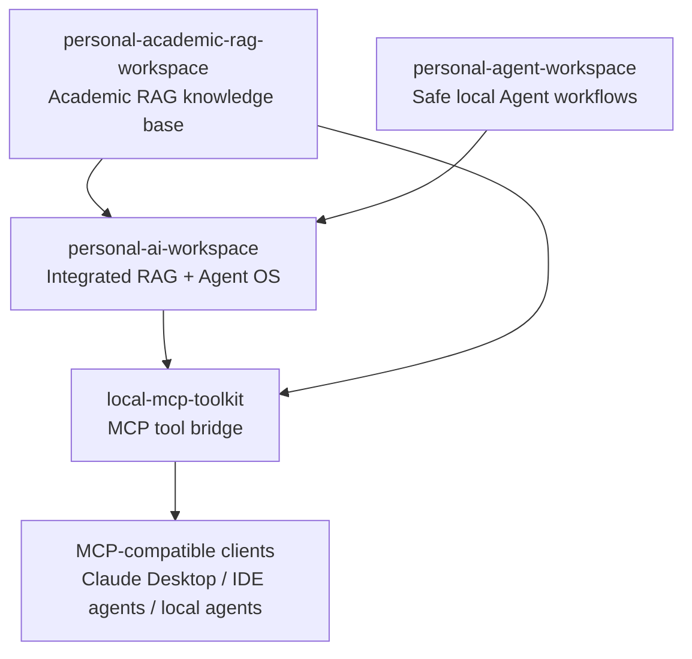

# Personal AI Research Suite

This monorepo packages four related local AI systems into one GitHub-ready repository:

1. `personal-academic-rag-workspace`: academic and personal knowledge-base RAG.
2. `personal-agent-workspace`: local personal Agent workbench with safe tool calling.
3. `personal-ai-workspace`: integrated Personal AI OS with RAG, Agent, API, MCP-like tools, evaluation, and observability.
4. `local-mcp-toolkit`: MCP-style toolkit that exposes local RAG, filesystem, and code tools to AI clients.

The four projects are independent enough to run separately, but they are designed to work together as one stack.

## System Relationship



## Repository Layout

```text
personal-ai-research-suite/
├── modules/
│   ├── personal-academic-rag-workspace/
│   ├── personal-agent-workspace/
│   ├── personal-ai-workspace/
│   └── local-mcp-toolkit/
├── docs/
│   ├── cn/
│   └── en/
├── scripts/
│   ├── sync_projects.ps1
│   ├── install_all.ps1
│   ├── test_all.ps1
│   └── doctor_all.ps1
├── .env.example
├── .gitignore
└── README.md
```

## Quick Start

Sync the latest local project sources into the monorepo:

```powershell
.\scripts\sync_projects.ps1
```

Install dependencies:

```powershell
.\scripts\install_all.ps1
```

Run diagnostics:

```powershell
.\scripts\doctor_all.ps1
```

Run tests:

```powershell
.\scripts\test_all.ps1
```

## Real LLM API Mode

Copy `.env.example` to `.env` and set:

```powershell
OPENAI_API_KEY=sk-your-key
OPENAI_BASE_URL=https://api.openai.com/v1
```

Each module also has its own production config. Use the module docs for exact commands.

## Documentation

Chinese:

- [系统总览](docs/cn/SYSTEM_OVERVIEW.md)
- [使用文档：personal-academic-rag-workspace](docs/cn/USAGE_personal-academic-rag-workspace.md)
- [开发文档：personal-academic-rag-workspace](docs/cn/DEVELOPMENT_personal-academic-rag-workspace.md)
- [使用文档：personal-agent-workspace](docs/cn/USAGE_personal-agent-workspace.md)
- [开发文档：personal-agent-workspace](docs/cn/DEVELOPMENT_personal-agent-workspace.md)
- [使用文档：personal-ai-workspace](docs/cn/USAGE_personal-ai-workspace.md)
- [开发文档：personal-ai-workspace](docs/cn/DEVELOPMENT_personal-ai-workspace.md)
- [使用文档：local-mcp-toolkit](docs/cn/USAGE_local-mcp-toolkit.md)
- [开发文档：local-mcp-toolkit](docs/cn/DEVELOPMENT_local-mcp-toolkit.md)

English:

- [System Overview](docs/en/SYSTEM_OVERVIEW.md)
- [Usage: personal-academic-rag-workspace](docs/en/USAGE_personal-academic-rag-workspace.md)
- [Development: personal-academic-rag-workspace](docs/en/DEVELOPMENT_personal-academic-rag-workspace.md)
- [Usage: personal-agent-workspace](docs/en/USAGE_personal-agent-workspace.md)
- [Development: personal-agent-workspace](docs/en/DEVELOPMENT_personal-agent-workspace.md)
- [Usage: personal-ai-workspace](docs/en/USAGE_personal-ai-workspace.md)
- [Development: personal-ai-workspace](docs/en/DEVELOPMENT_personal-ai-workspace.md)
- [Usage: local-mcp-toolkit](docs/en/USAGE_local-mcp-toolkit.md)
- [Development: local-mcp-toolkit](docs/en/DEVELOPMENT_local-mcp-toolkit.md)

## Resume Summary

Built a local Personal AI Research Suite integrating academic RAG, safe Agent workflows, a personal AI operating layer, and an MCP-compatible tool bridge. The suite supports multi-format document ingestion, hybrid retrieval, reranking, grounded citations, OpenAI-compatible LLM/embedding APIs, safe tool calling with dry-run and audit logs, multi-agent paper reading workflows, FastAPI/Streamlit interfaces, and MCP-style tool exposure for external AI clients.
