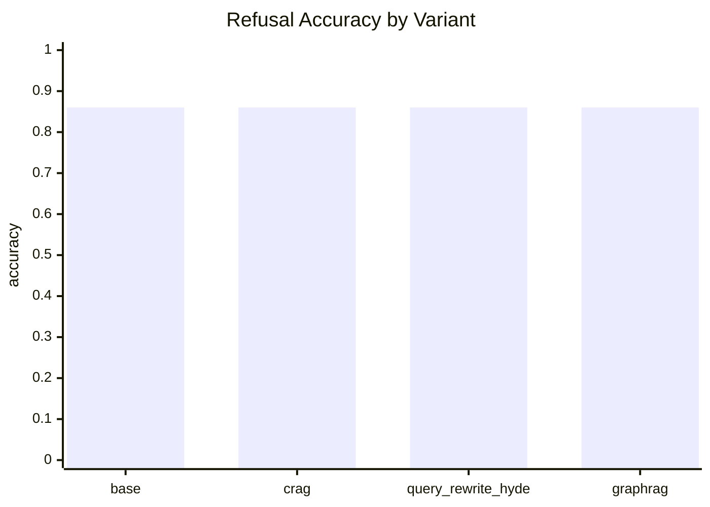

# ScholarMind RAG Benchmark Report

> Reproducible benchmark over public AI paper fact cards. Replace the default corpus with a reviewed local paper directory before making domain-specific performance claims.
> **Evaluation mode:** Offline/mock baseline: RAGAS was not executed. Run with `--config config.production.yaml --ragas` before using numerical claims in a resume.

## Protocol

- Cases: 50 (simple=15, complex=15, multi_hop=10, out_of_scope=10)
- Variants: Base hybrid RAG, CRAG routing, HyDE query rewrite, Hybrid + GraphRAG.
- Deterministic metrics: source hit, citation presence, refusal accuracy, keyword coverage, confidence, and latency.
- RAGAS is optional because it requires a configured evaluator model; out-of-scope cases are evaluated by refusal accuracy rather than answer-quality metrics.

## Overall Comparison

| Variant | Source hit | Expected-source recall | Citation | Refusal | Keyword coverage | Avg confidence | Avg latency (ms) |
|---|---:|---:|---:|---:|---:|---:|---:|
| base | 0.980 | 0.963 | 1.000 | 0.860 | 0.310 | 0.571 | 4.324 |
| crag | 0.980 | 0.963 | 1.000 | 0.860 | 0.310 | 0.571 | 4.703 |
| query_rewrite_hyde | 0.980 | 0.963 | 1.000 | 0.860 | 0.310 | 0.572 | 7.138 |
| graphrag | 0.620 | 0.425 | 1.000 | 0.860 | 0.220 | 0.898 | 27.312 |

## Refusal Accuracy Chart

## Category: simple

| Variant | Source hit | Expected-source recall | Citation | Refusal | Keyword coverage |
|---|---:|---:|---:|---:|---:|
| base | 0.933 | 0.933 | 1.000 | 1.000 | 0.300 |
| crag | 0.933 | 0.933 | 1.000 | 1.000 | 0.300 |
| query_rewrite_hyde | 0.933 | 0.933 | 1.000 | 1.000 | 0.300 |
| graphrag | 0.600 | 0.600 | 1.000 | 1.000 | 0.200 |

## Category: complex

| Variant | Source hit | Expected-source recall | Citation | Refusal | Keyword coverage |
|---|---:|---:|---:|---:|---:|
| base | 1.000 | 1.000 | 1.000 | 1.000 | 0.500 |
| crag | 1.000 | 1.000 | 1.000 | 1.000 | 0.500 |
| query_rewrite_hyde | 1.000 | 1.000 | 1.000 | 1.000 | 0.500 |
| graphrag | 0.533 | 0.367 | 1.000 | 1.000 | 0.400 |

## Category: multi_hop

| Variant | Source hit | Expected-source recall | Citation | Refusal | Keyword coverage |
|---|---:|---:|---:|---:|---:|
| base | 1.000 | 0.950 | 1.000 | 1.000 | 0.350 |
| crag | 1.000 | 0.950 | 1.000 | 1.000 | 0.350 |
| query_rewrite_hyde | 1.000 | 0.950 | 1.000 | 1.000 | 0.350 |
| graphrag | 0.400 | 0.250 | 1.000 | 1.000 | 0.200 |

## Category: out_of_scope

| Variant | Source hit | Expected-source recall | Citation | Refusal | Keyword coverage |
|---|---:|---:|---:|---:|---:|
| base | 1.000 | 0.000 | 0.000 | 0.300 | 0.000 |
| crag | 1.000 | 0.000 | 0.000 | 0.300 | 0.000 |
| query_rewrite_hyde | 1.000 | 0.000 | 0.000 | 0.300 | 0.000 |
| graphrag | 1.000 | 0.000 | 0.000 | 0.300 | 0.000 |

## RAGAS

| Variant | Status | Faithfulness | Answer relevancy | Context precision | Context recall |
|---|---|---:|---:|---:|---:|
| base | disabled | - | - | - | - |
| crag | disabled | - | - | - | - |
| query_rewrite_hyde | disabled | - | - | - | - |
| graphrag | disabled | - | - | - | - |

## Key Findings

- Best deterministic source-hit variant: `query_rewrite_hyde`.
- Best refusal-accuracy variant: `query_rewrite_hyde`.
- RAGAS was not available; configure an OpenAI-compatible evaluator and rerun with `--ragas`.

## Resume-Safe Interpretation

This report demonstrates a reproducible evaluation harness, not a universal claim that one retrieval strategy always wins. Report the corpus, model, configuration, latency, and refusal behavior together; rerun on your own reviewed paper set before citing numbers in a resume or interview.
